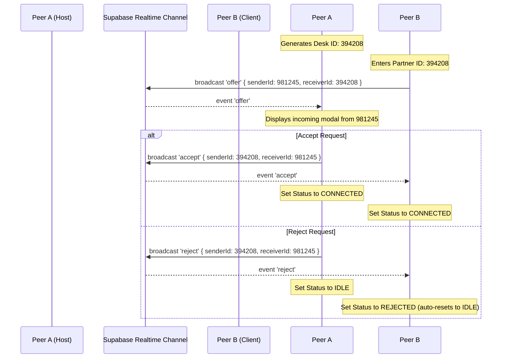

# ControlDesk Ai - Code Structure & Architecture

This document outlines the directory layout, files, and architectural flows for **ControlDesk Ai**, a premium remote desktop application built using Tauri + React (Vite) + Supabase Realtime signaling.

---

## 1. Directory Structure

```text
controldesk.ai/
├── src-tauri/                 # Tauri backend directory (Rust configuration, build icons, desktop build logic)
├── src/                       # React frontend source directory
│   ├── assets/                # Images, SVG logos, and other static design assets
│   ├── lib/
│   │   └── supabase.ts        # Supabase Client initialization & environment variable load
│   ├── index.css              # Main stylesheet containing Tailwind directives
│   ├── App.css                # Legacy stylesheet (unused or placeholder)
│   ├── App.tsx                # Main UI Shell & signaling logic (WebRTC peer coordination)
│   ├── main.tsx               # DOM entry point loading App inside React.StrictMode
│   └── vite-env.d.ts          # Vite build environment types
├── .env                       # Local environment variables containing Supabase API Keys
├── index.html                 # Main single page application DOM entrypoint
├── tailwind.config.js         # Tailwind CSS design system rules and path content mapping
├── postcss.config.js          # PostCSS processor plugins mapping
├── package.json               # Node dependencies & compilation scripts
├── tsconfig.json              # TypeScript compilation rules
└── vite.config.ts             # Vite server and Tauri port configuration rules
```

---

## 2. Supabase Configuration (`src/lib/supabase.ts`)

Imports `@supabase/supabase-js` and exports an initialized Supabase Client. Reads credentials safely via Vite env mapping:
- `import.meta.env.VITE_SUPABASE_URL`
- `import.meta.env.VITE_SUPABASE_ANON_KEY`

If variables are missing at build-time, a clear warnings system prints debug guidelines while providing fallback endpoints to prevent application runtime startup crashes.

---

## 3. Remote Signaling Architecture

Instead of utilizing database tables (which incurs connection latency and storage overheads), ControlDesk Ai coordinates desktop sharing negotiations via **Supabase Realtime Broadcast Channels**.

### The Signaling Flow (Channel Name: `desk_signals`)



### Signal Message Schemas

1. **Offer** (`event: "offer"`)
   ```json
   {
     "senderId": "981245",
     "receiverId": "394208",
     "metadata": {
       "timestamp": 1716388910000,
       "platform": "Tauri Desktop"
     }
   }
   ```
2. **Accept** (`event: "accept"`)
   ```json
   {
     "senderId": "394208",
     "receiverId": "981245"
   }
   ```
3. **Reject** (`event: "reject"`)
   ```json
   {
     "senderId": "394208",
     "receiverId": "981245"
   }
   ```
4. **Disconnect** (`event: "disconnect"`)
   ```json
     {
       "senderId": "394208",
       "receiverId": "981245"
     }
   ```

---

## 4. Theme Configuration (System, Light, Dark)

Theme settings are saved under `localStorage` (`controldesk-theme`).
- When **System** is active, a media listener listens to `(prefers-color-scheme: dark)` updates on the OS, applying the appropriate `.dark` class to `document.documentElement` dynamically without page reload.
- Standard Tailwind class prefixes (`dark:bg-zinc-950`, `dark:text-zinc-50`) handle rendering color swaps transparently.

---

## 5. Development and Build Instructions

To test the application:
1. Ensure your `.env` contains:
   ```env
   VITE_SUPABASE_URL=https://your-project.supabase.co
   VITE_SUPABASE_ANON_KEY=your-anon-key
   ```
2. Ensure Supabase Realtime is enabled on your project settings.
3. Install node dependencies:
   ```bash
   npm install
   ```
4. Launch local dev environment:
   ```bash
   npm run dev
   ```
5. Compile production code:
   ```bash
   npm run build
   ```
